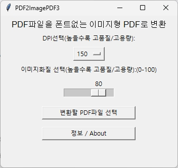
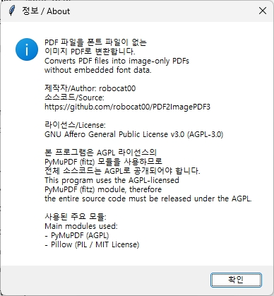

# PDF2ImagePDF

PDF 파일을 **폰트가 포함되지 않은 이미지형 PDF**로 변환하는 간단한 도구입니다.  
PDF를 공유할 때 발생할 수 있는 **폰트 라이선스 문제를 피하기 위해** 만들었습니다.

---

## 기능
## What does it do?

- PDF 각 페이지를 이미지로 렌더링
- 폰트 데이터가 포함되지 않은 PDF로 재저장
- 결과물은 **image-only PDF**

---

## 다운로드
## Download

- Windows 실행 파일은 **GitHub Releases**에서 제공됩니다.
- 실행 파일은 Python이 없어도 동작합니다.

---

## License

- **AGPL-3.0**
- Source code is available in this repository.

---

## Used libraries

- PyMuPDF (AGPL)
- Pillow (MIT)
